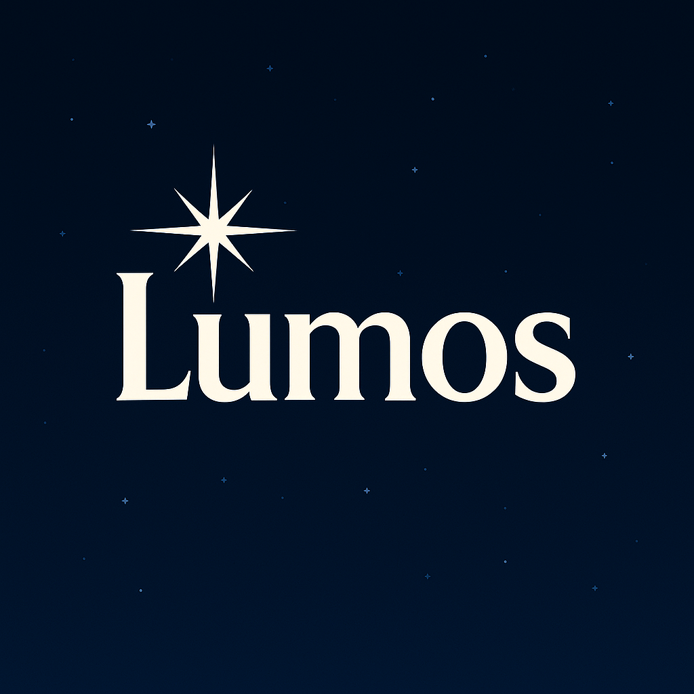
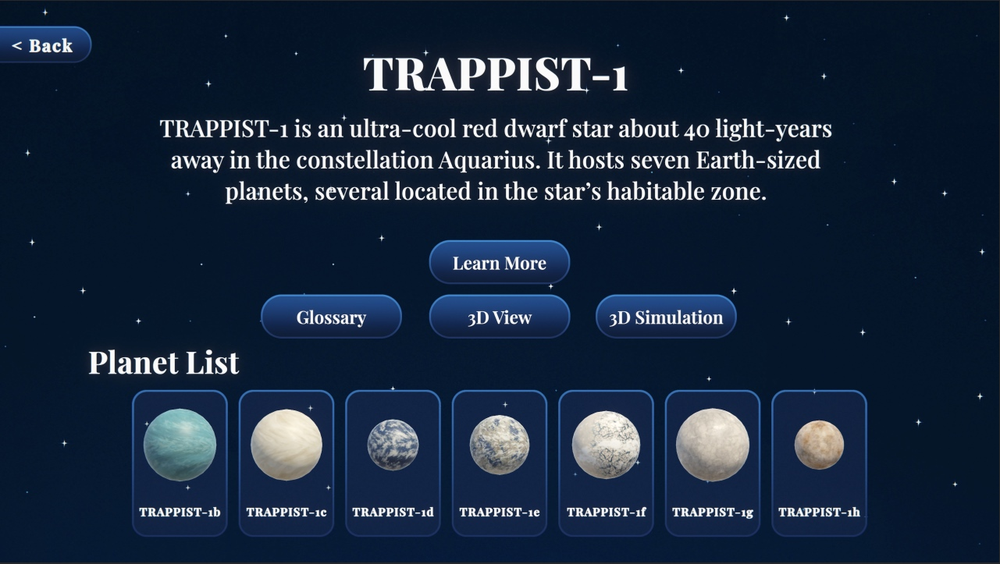
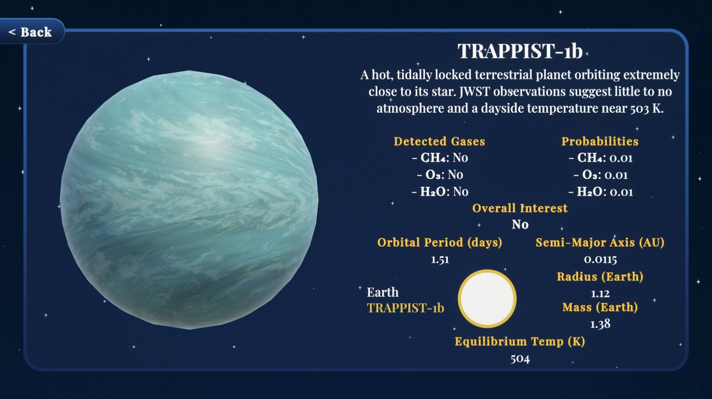
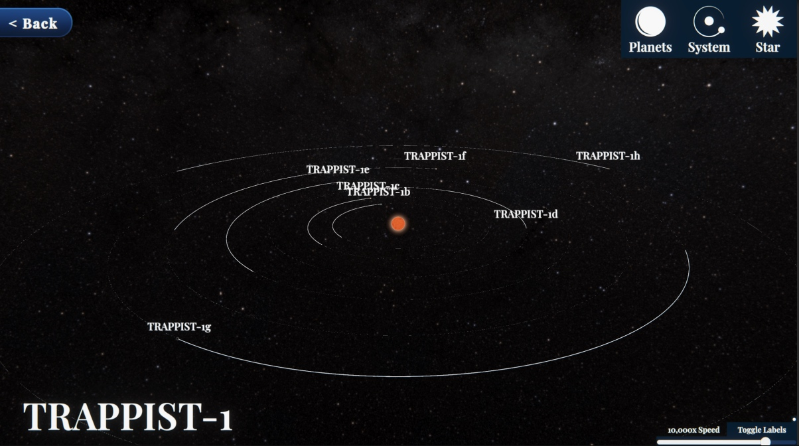
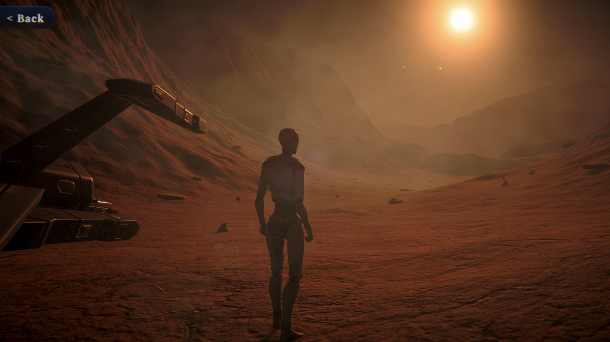

  
  <h1>Lumos</h1>
  

    
    
    
  

  
An interactive exoplanet exploration experience centered on the TRAPPIST‑1 planetary system.

## Screenshots

  

  

  

  

## Overview

Lumos is a Unity-based educational visualization project where users explore planetary data, examine exoplanet properties, and navigate the TRAPPIST‑1 system through several interactive scenes.

The project combines:
- Data-driven planet profiles
- 3D orbital/system visualization
- Guided UI for scientific exploration

## Features

- Planet list dynamically generated from JSON data
- Detailed planet panels displaying scientific metrics and atmospheric labels
- System overview page for the TRAPPIST‑1 system
- In‑app glossary covering key astronomy and biosignature concepts
- Orbital simulation scene with selectable planet targeting
- Walkaround environment scene for immersive exploration

## Scene Flow

- `MainScene` - primary interface for browsing planets, viewing system information, and accessing the glossary
- `SpaceScene` - interactive 3D visualization of the TRAPPIST‑1 system with orbital motion and planet targeting
- `SimulationScene` - third‑person exploration scene built using Unity Starter Assets

## Tech Stack

- Unity 6 (`6000.1.0f1`)
- C#
- Universal Render Pipeline (URP)
- Unity Input System
- JSON data pipeline using Unity `Resources`

## Project Structure

- `Assets/Scenes` - Unity scenes used in the project
- `Assets/Scripts/Data` - data models and JSON loading logic
- `Assets/Scripts/UI` - interface and menu systems
- `Assets/Scripts/SystemView` - orbital simulation and system visualization logic
- `Assets/Resources/PlanetData` - planet, system, and glossary JSON data
- `Pictures` - README media assets (logo and screenshots)

## Third-Party Assets and Credits

This project incorporates several third‑party assets and tools:

- [Realistic Volume Profiles](https://assetstore.unity.com/packages/tools/level-design/realistic-volume-profiles-274875) - lighting and post‑processing profiles by Apper Interactive
- [Mars Landscape 3D](https://assetstore.unity.com/packages/3d/environments/landscapes/mars-landscape-3d-175814) - environment assets by Evgenii Nikolskii
- [Planets of the Solar System 3D](https://assetstore.unity.com/packages/3d/environments/planets-of-the-solar-system-3d-90219) - planetary models by Evgenii Nikolskii
- Procedural Terrain Painter - terrain painting tools for Unity
- [Unity Starter Assets - Third Person Character Controller](https://assetstore.unity.com/packages/essentials/starter-assets-third-person-character-controller-196526) - by Unity Technologies
- [Star Sparrow Modular Spaceship | 3D Space](https://assetstore.unity.com/packages/3d/vehicles/space/star-sparrow-modular-spaceship-73167) - modular spaceship model
- [Yughues Free Ground Materials](https://assetstore.unity.com/packages/2d/textures-materials/floors/yughues-free-ground-materials-13001) - ground material pack by Yughues

Additional textures and reference imagery were sourced from publicly available NASA resources.

## Notes

This repository contains the Unity project files used to develop and test the Lumos prototype.
